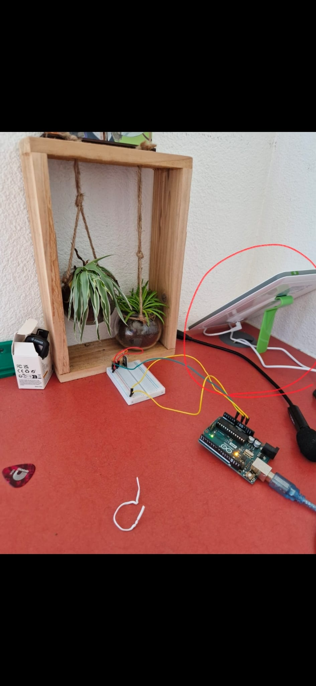

# Plant Sensor

This TinyGo-based application monitors light levels for a plant using a KY-018 photoresistor module and a 10k resistor. It calculates a rolling average of lux values to determine if the current lighting is optimal, too low, or too high, providing real-time status updates via serial output.

The sensor samples every 500ms and uses a quadratic approximation to convert raw ADC readings into lux. It targets a light range between 1000 and 5000 lux, helping you ensure your plant receives the right amount of light for healthy growth.

